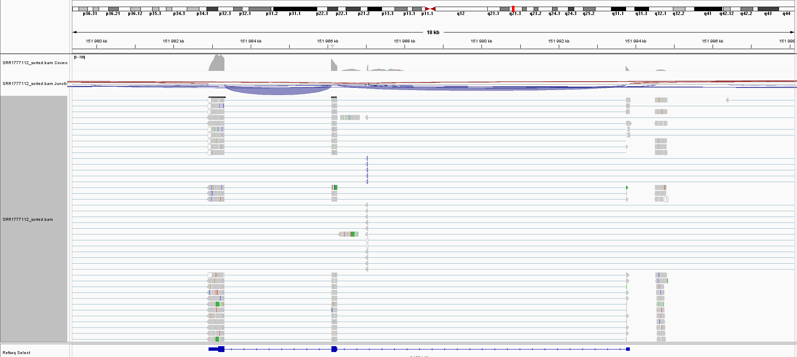

# Analyza-rodiny-S100A
Analýza genu z rodiny S100A z BioProjectu PRJNA273802, vybrala jsem si run SRR1777112.  
Postup: 
1. Stažení dat pomocí `sra-toolkit`.
2. Mapování na referenční genom hg38 pomocí `hisat2`.
3. Kvantifikace pomocí `featureCounts`.
4. Výpočet TPM a filtrace v `R`.

Nejdříve je potřeba spustit ```pipeline.sh```, a poté ```analyza.R```
## Výsledky relativní exprese (TPM)

V rámci analýzy byly naměřeny následující hodnoty TPM (Transcripts Per Million). Tabulka obsahuje HGNC ID a vypočítanou relativní expresi.

| HGNC ID | Symbol | TPM |
| :--- | :--- | :--- |
| **10485** | S100A11 | 3222.73 |
| **10484** | S100A10 | 1006.76 |
| **10499** | S100A9  | 468.81 |
| **10493** | S100A6  | 248.35 |
| **14502** | S100A16 | 89.06 |
| **10490** | S100A13 | 0.33 |

### Interpretace výsledků
Naměřená data ukazují na velmi vysokou aktivitu genů **S100A11** a **S100A10**, to že jsou geny vysoce aktivní souvisí pravděpodobně s faktem, že vzorky pochází z rakovinné buňky. Tyto geny buňce pomahají proliferaci a invazi do okolních tkání. Naopak gen **S100A13** je v těchto buňkách téměř neaktivní (TPM blízké nule). Tento výrazný rozdíl různé transkripční aktivity ukazuje vysokou úroveň tkáňově specifické regulace těchto genů. Další geny z rodiny neměly v tomto běhu žádnou expresi, to ale realně nemusí znamenat, že v buňce nejsou exprimované, mohlo dojít i k tomu, že RNA ostatnich genů z rodiny bylo málo.  
## Vizualizace výsledků v IGV

Obrázek detailu genu **S100A10**. Šedé bloky představují namapované ready na referenční genom hg38. Modré oblouky znázorňují místa sestřihu, kde byly z RNA vystřiženy introny.



V oblasti jsou patrné jasné exony s vysokým pokrytím, které přesně odpovídají anotaci genu. Přítomnost barevných variant v reads může indikovat nukleotidové neshody (SNP) v testovaném vzorku. To že jde o mutace je pravděpodobné s ohledem na původ vzorku z hepatocelularniho karcinomu.
